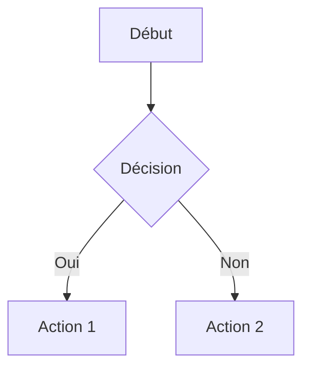

---
***Références :***

---

> [!tip]
> Obsidian utilise principalement le [[Markdown]] pour l'édition des notes

## 🚀 Raccourcis Clavier Essentiels

### Navigation et Fichiers

- `Ctrl + N` - Nouvelle note
- `Ctrl + O` - Ouvrir note / Quick switcher
- `Ctrl + P` - Palette de commandes
- `Ctrl + Shift + F` - Recherche globale
- `Ctrl + E` - Basculer mode édition/lecture
- `Ctrl + ,` - Paramètres
- `Ctrl + Tab` - Changer d'onglet
- `Ctrl + W` - Fermer onglet actuel

### Édition Obsidian

- `Ctrl + B` - **Gras**
- `Ctrl + I` - _Italique_
- `Ctrl + K` - Créer un lien interne
- `Ctrl + ]` - Indenter
- `Ctrl + [` - Désindenter
- `Ctrl + /` - Commenter/décommenter
- `Ctrl + Enter` - Suivre le lien sous le curseur
- `Ctrl + Shift + K` - Supprimer ligne
- `Ctrl + D` - Supprimer mot

### Vue et Interface

- `Ctrl + \` - Basculer barre latérale gauche
- `Ctrl + Shift + \` - Basculer barre latérale droite
- `Ctrl + +/-` - Zoom in/out
- `F11` - Mode plein écran
- `Ctrl + G` - Ouvrir Graph View
- `Alt + ←/→` - Navigation historique

### Raccourcis de Frappe

- `[[` - Créer un lien interne
- `((` - Créer un lien vers un bloc
- `#` - Créer/rechercher un tag
- `---` - Ligne horizontale
- `""` + espace - Citation
- `- [ ]` + espace - Case à cocher

## 🔗 Fonctionnalités Obsidian Spécifiques

### Liens Internes

```markdown
[[Nom de la note]]
[[Nom de la note|Texte affiché]]
[[Note#Section]]
[[Note#^bloc-id]]
![[Note]] <!-- Embed complet -->
![[Note#Section]] <!-- Embed section -->
```

### Tags

```markdown
#tag
#tag/sous-tag
#tag-avec-tirets
#📝/notes
```

### Formatage Étendu

```markdown
==Surligné==
%%Commentaire invisible%%
```

### Callouts (Admonitions)

```markdown
> [!note] Note
> Contenu de la note

> [!tip] Astuce
> Conseil utile

> [!warning] Attention
> Message d'avertissement

> [!danger] Danger
> Alerte importante

> [!example] Exemple
> Exemple concret

> [!quote] Citation
> Citation importante

> [!info] Information
> Information supplémentaire

> [!success] Succès
> Message de succès

> [!question] Question
> Question à retenir

> [!failure] Échec
> Message d'échec

> [!bug] Bug
> Rapport de bug

> [!abstract] Résumé
> Résumé du contenu
```

### Callouts Pliables

```markdown
> [!note]- Note pliée par défaut
> Contenu masqué

> [!tip]+ Astuce dépliée par défaut
> Contenu visible
```

### Formules Mathématiques (MathJax)

```markdown
Inline: $E = mc^2$

Bloc:
$$
\sum_{i=1}^{n} x_i = x_1 + x_2 + ... + x_n
$$
```

### Diagrammes Mermaid

````markdown

````

### Blocs avec ID

```markdown
Texte important ^bloc-123

Référence: [[#^bloc-123]]
```

### Embedded Notes

```markdown
![[Autre note]]
![[Note#Section spécifique]]
![[Note^bloc-id]]
```

## 🎯 Navigation et Recherche

### Opérateurs de Recherche

```markdown
file:"nom du fichier"
path:"dossier/"
tag:#important
line:(contenu spécifique)
section:(titre de section)
block:(contenu de bloc)
```

### Combinaisons de Recherche

```markdown
tag:#projet AND file:"2024"
(tag:#important OR tag:#urgent) path:"Work/"
-tag:#archive
```

### Graph View

- **Filtres** : Exclure/inclure des notes
- **Groupes** : Organiser par tags ou dossiers
- **Forces** : Ajuster la répulsion/attraction
- **Navigation** : Clic pour ouvrir, glisser pour explorer

## 🔧 Templates et Automatisation

### Variables de Template

```markdown
{{title}} - Titre de la note
{{date}} - Date actuelle
{{time}} - Heure actuelle
{{date:YYYY-MM-DD}} - Date formatée
```

### Exemple de Template

```markdown
# {{title}}

**Créé le :** {{date:YYYY-MM-DD}} à {{time}}

**Tags :** #

## Notes

## Actions

## Références
```

## 📊 Plugins Essentiels

### Plugins Core

- **File explorer** - Navigation des fichiers
- **Search** - Recherche globale
- **Quick switcher** - Changement rapide de note
- **Graph view** - Vue graphique des liens
- **Backlinks** - Liens entrants
- **Outgoing links** - Liens sortants
- **Tag pane** - Panneau des tags
- **Word count** - Compteur de mots

### Plugins Communautaires Populaires

- **Calendar** - Vue calendrier des notes
- **Kanban** - Tableaux kanban
- **Dataview** - Requêtes sur les métadonnées
- **Templater** - Templates avancés
- **Advanced Tables** - Édition de tableaux
- **Mind Map** - Cartes mentales
- **Excalidraw** - Dessins et schémas

## 🎨 Personnalisation

### CSS Snippets (`.obsidian/snippets/`)

```css
/* Changer la couleur des liens internes */
.markdown-preview-view .internal-link {
    color: #7c3aed;
}

/* Personnaliser les callouts */
.callout[data-callout="custom"] {
    --callout-color: 255, 0, 0;
}
```

### Hotkeys Personnalisés

1. Paramètres → Hotkeys
2. Rechercher la commande
3. Assigner un raccourci
4. Tester la configuration


---

_Fiche spécialisée pour maîtriser Obsidian_ 🧠